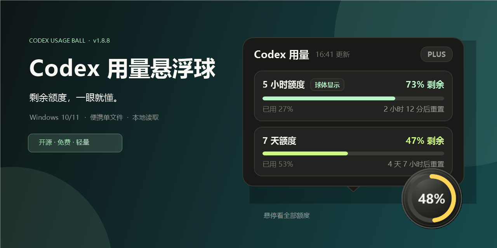
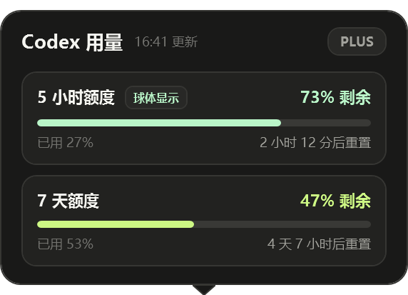
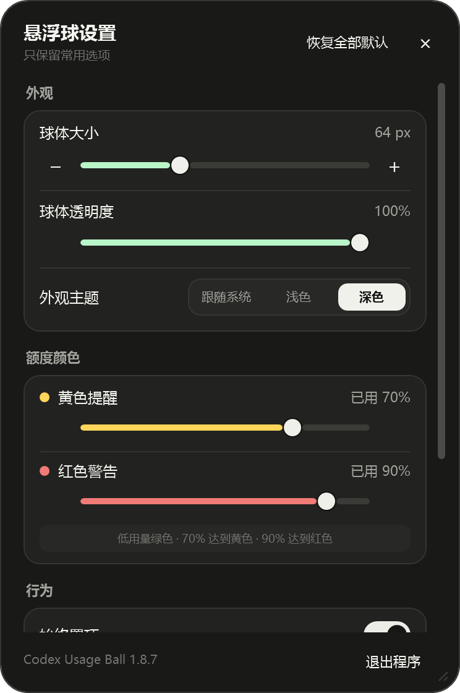
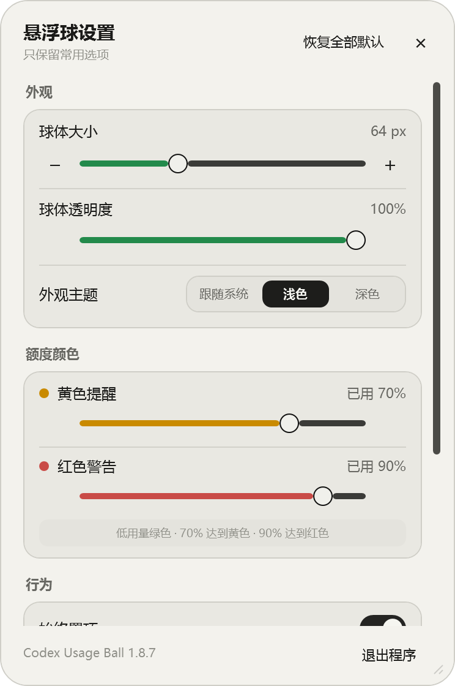

<p align="center">
  
</p>

<p align="center">
  一个安静待在 Windows 桌面角落的 Codex 用量悬浮球。<br />
  不必反复打开用量页面，抬眼就能看到剩余额度与重置时间。
</p>

<p align="center">
  <a href="https://github.com/xyingdi/codex-usage-ball/releases/latest"></a>
  
  
  <a href="LICENSE"></a>
</p>

> [!IMPORTANT]
> 这是第三方开源工具，不是 OpenAI 或 Codex 官方产品。它需要本机已经安装并登录 Codex 桌面应用。

## 为什么做这个悬浮球

Codex 的用量本来不复杂，真正麻烦的是每次都要停下工作、打开页面、再确认还剩多少。这个工具只保留最常用的信息：一个始终可见的剩余百分比，以及悬停时出现的全部额度与重置时间。

没有重复的详情页，也没有持续播放的装饰动画。球体静止时保持安静，只有刷新、状态变化和交互发生时才播放轻量过渡。

## 界面

### 一眼看懂当前风险

<p align="center">
  
</p>

- 球心只显示剩余百分比，始终保持视觉居中。
- 悬停时按官方实际返回结果显示全部额度窗口；有几个就显示几个，不保留无效占位。
- 默认“智能推荐”短周期额度；任一额度进入预警后，自动优先显示风险更高、剩余更少的一项。
- 右键可固定球体显示的额度；如果该额度以后被官方移除，会自动回到智能推荐。
- 外圈颜色按剩余用量连续渐变：薄荷绿 → 警示黄 → 红色，不会在阈值处突然跳色。

### 外观由你决定

<table>
  <tr>
    <td align="center"></td>
    <td align="center"></td>
  </tr>
  <tr>
    <td align="center">深色</td>
    <td align="center">浅色</td>
  </tr>
</table>

- 球体大小：48–96 px
- 球体透明度：30%–100%
- 主题：跟随系统 / 浅色 / 深色
- 黄色、红色阈值：可按 5% 步进调整
- 设置窗口：四边与四角均可自由缩放，大小会自动保存
- 动画：低性能设备可一键关闭
- 恢复全部默认：外观、阈值、行为、位置和窗口大小一次复原

## 操作方式

| 操作 | 结果 |
| --- | --- |
| 悬停球体 | 查看全部额度、已用比例和重置时间 |
| 拖动球体 | 自由移动，靠近屏幕边缘时自动吸附 |
| 双击球体 | 打开 Codex |
| 单击球体 | 默认不执行操作；可在设置中改为循环切换额度 |
| 右键球体 | 刷新额度、选择显示额度、打开设置或退出 |

## 下载与使用

1. 打开 [最新 Release](https://github.com/xyingdi/codex-usage-ball/releases/latest)。
2. 下载 `Codex-Usage-Ball-v1.8.8-win-x64.exe`；如需校验，可同时下载 `SHA256.txt`。
3. 确保 Codex 桌面应用已经安装并登录，然后双击运行。

程序是自包含的 Windows x64 单文件，不需要安装，也不需要另外安装 .NET。设置保存在：

```text
%LOCALAPPDATA%\CodexUsageBall\settings.json
```

### 关于 SmartScreen

当前公开构建没有商业代码签名证书，Windows 首次运行时可能出现 SmartScreen 提示。请只从本仓库的 Release 下载，并核对 `SHA256.txt`；确认来源后，可选择“更多信息”继续运行。

SHA-256 用来确认文件没有损坏或被替换，不等同于代码签名。

## 数据与隐私

- 仅通过本机 Codex App Server 的 `account/rateLimits/read` 读取额度窗口。
- 不抓取 Codex 网页，不读取或保存 ChatGPT 密码。
- 不把账号信息或用量数据上传到第三方服务。
- 悬浮球隐藏后会停止用量读取，不在后台持续查询。

## 资源占用设计

- 可见时最长约 60 秒自动刷新一次。
- 悬停时如数据超过 30 秒未更新，会优先刷新。
- 静止状态没有呼吸、扫光或光晕等持续动画。
- 同时只允许一个悬浮球实例运行。

## 从源码构建

需要 Windows 10/11 x64 与 [.NET 8 SDK](https://dotnet.microsoft.com/download/dotnet/8.0)。

```powershell
.\scripts\build-portable.ps1
```

构建结果位于 `artifacts/release`，包含单文件程序和 SHA-256 校验记录。

## 参与项目

遇到问题请提交 [Bug 报告](https://github.com/xyingdi/codex-usage-ball/issues/new?template=bug.yml)，建议新功能请提交 [功能建议](https://github.com/xyingdi/codex-usage-ball/issues/new?template=feature.yml)。为了保护隐私，请不要在截图或日志中附带账号、令牌或完整本机路径。

## 许可与致谢

源码采用 [MIT License](LICENSE)。本项目与 OpenAI 无隶属或背书关系；Codex、OpenAI 等名称及标识归其各自权利人所有。
